# File Dependency Flow Diagram

This diagram shows the actual file transfer dependencies between agents - how Agent X output files become Agent Y input files.

## File Dependency Architecture

```mermaid
flowchart TD
    %% Input Sources
    INPUT_QA[📝 12 Strategic Questions<br/>qa_session_content.md] --> Agent1
    INPUT_CSV[📊 Customer Reviews<br/>customer_reviews.csv] --> Agent3
    
    %% Agent 1 - Message House
    Agent1[🏠 Agent1: Message House] --> MSG[📄 message_house.md]
    MSG --> Agent2
    MSG --> Agent5
    MSG --> Agent8
    MSG --> Agent9
    
    %% Agent 2 - Brand Personas  
    Agent2[👤 Agent2: Brand Personas] --> BRAND[📄 brand_side_persona.md]
    BRAND --> Agent4
    BRAND --> Agent5
    BRAND --> Agent8
    BRAND --> BRAND_FALLBACK{Brand Mode?}
    BRAND_FALLBACK -->|Yes| Agent7
    BRAND_FALLBACK -->|Yes| Agent8_BRAND[Agent8: Uses Brand Persona]
    
    %% Agent 3 - Customer Analysis
    Agent3[👥 Agent3: Customer Analysis] --> CUSTOMER[📄 customer_side_persona.md]
    CUSTOMER --> Agent4
    CUSTOMER --> Agent5
    CUSTOMER --> Agent7
    CUSTOMER --> Agent8
    CUSTOMER --> Agent9
    
    %% Agent 4 - Gap Analysis
    Agent4[📊 Agent4: Gap Analysis] --> GAP[📄 gap_analysis.md]
    GAP --> Agent6
    
    %% Agent 5 - Keywords Bank (Two Phase)
    Agent5[🔑 Agent5: Keywords Bank] --> KEYWORDS[📄 keywords_bank.md]
    KEYWORDS --> Agent7
    KEYWORDS --> Agent8
    KEYWORDS --> Agent9
    
    %% Agent 7 - Testimonials
    Agent7[💬 Agent7: Testimonials] --> TESTIMONIALS[📄 testimonials.md]
    TESTIMONIALS --> Agent8
    TESTIMONIALS --> Agent9
    
    %% Agent 8 - Social Media
    Agent8[📱 Agent8: Social Media] --> TWITTER[📄 twitter_posts.md]
    Agent8_BRAND --> TWITTER
    TWITTER --> Agent10
    
    %% Agent 9 - Website Copy
    Agent9[🌐 Agent9: Website Copy] --> WEBSITE[📄 website_copy.md]
    WEBSITE --> Agent10
    
    %% Optional Enhancement Layer
    Agent6[📋 Agent6: Stakeholder Decks] --> STAKEHOLDER[📄 stakeholder_strategy.md]
    Agent6_5[🎯 Agent6.5: Platform Intelligence] --> PLATFORM[📄 platform_personas.md]
    PLATFORM --> Agent8
    
    %% Final Consistency Check
    Agent10[✅ Agent10: Consistency Check] --> CONSISTENCY[📄 consistency_report.md]
    
    %% Final Output Collection
    TESTIMONIALS --> FINAL[📁 Complete Asset Portfolio]
    TWITTER --> FINAL
    WEBSITE --> FINAL
    STAKEHOLDER --> FINAL
    CONSISTENCY --> FINAL
    
    %% Styling
    classDef input fill:#e3f2fd,stroke:#1976d2,stroke-width:2px
    classDef agent fill:#f3e5f5,stroke:#7b1fa2,stroke-width:2px
    classDef file fill:#e8f5e8,stroke:#388e3c,stroke-width:2px
    classDef decision fill:#fff3e0,stroke:#f57c00,stroke-width:2px
    classDef output fill:#ffebee,stroke:#d32f2f,stroke-width:2px
    
    class INPUT_QA,INPUT_CSV input
    class Agent1,Agent2,Agent3,Agent4,Agent5,Agent6,Agent6_5,Agent7,Agent8,Agent8_BRAND,Agent9,Agent10 agent
    class MSG,BRAND,CUSTOMER,GAP,KEYWORDS,TESTIMONIALS,TWITTER,WEBSITE,STAKEHOLDER,PLATFORM,CONSISTENCY file
    class BRAND_FALLBACK decision
    class FINAL output
```

## Mode-Specific File Dependencies

### **Validation Mode Dependencies**

### **Brand Mode Dependencies (No Customer Data)**

## Key File Transfer Logic

### **Critical Dependencies**
- **Agent1 → Agent2,5,8,9**: `message_house.md` provides strategic foundation
- **Agent5 → Agent7,8,9**: `keywords_bank.md` enables content generation
- **Agent7 → Agent8,9**: `testimonials.md` provides authentic voice patterns

### **Mode-Specific Fallbacks**
- **Brand Mode**: Agent2 (`brand_side_persona.md`) replaces Agent3 (`customer_side_persona.md`) as input for Agent7,8
- **Validation Mode**: Both brand and customer personas feed into content agents for comprehensive analysis

### **File Naming Convention**
All output files follow the pattern: `{agent_purpose}_{timestamp}.md`
- Example: `messagehouse_20241215_143052.md`
- Example: `keywords_bank_20241215_145234.md`

---

*This diagram shows the actual file dependencies as implemented in the system orchestration logic.*