# Pipeline Execution Flow Diagram

This diagram shows the complete system execution flow with orchestration, modes, phases, and quality gates.

## Complete System Execution Flow

```mermaid
flowchart TD
    START[📋 User Starts Project] --> Agent0a[🔧 Agent 0a: Project Configurator]
    Agent0a --> |Industry-specific setup| Agent0b[⚡ Agent 0b: Pipeline Orchestrator]
    Agent0b --> MODE{🎯 Mode Detection}
    
    %% Mode Detection Logic
    MODE -->|Strategic Q&A + Customer Reviews| VAL[🔍 Validation Mode]
    MODE -->|Strategic Q&A only| BRAND[🚀 Brand Mode]
    
    %% Validation Mode Path
    VAL --> VAL_P1[📊 Phase 1: Foundation Building<br/>Agent1→Agent2→Agent3→Agent4→Agent5]
    VAL_P1 --> Agent1_V[Agent1: Message House]
    Agent1_V --> Agent2_V[Agent2: Brand Personas]
    Agent2_V --> Agent3_V[Agent3: Customer Analysis]
    Agent3_V --> Agent4_V[Agent4: Gap Analysis] 
    Agent4_V --> Agent5_P1_V[Agent5: Keywords Phase 1]
    
    %% Brand Mode Path  
    BRAND --> BRAND_P1[📊 Phase 1: Streamlined<br/>Agent1→Agent2→Agent5]
    BRAND_P1 --> Agent1_B[Agent1: Message House]
    Agent1_B --> Agent2_B[Agent2: Brand Personas]
    Agent2_B --> Agent5_P1_B[Agent5: Keywords Phase 1]
    
    %% Quality Gate Checkpoint
    Agent5_P1_V --> GATE[🚪 Quality Gate<br/>Keywords Evaluation<br/>≥7.0 Score Required]
    Agent5_P1_B --> GATE
    
    GATE -->|Score < 7.0| REJECT[❌ Re-run Phase 1<br/>Improve Strategy]
    GATE -->|Score ≥ 7.0| PHASE2[⚡ Phase 2: Content Generation]
    REJECT --> VAL_P1
    REJECT --> BRAND_P1
    
    %% Phase 2 (same for all modes)
    PHASE2 --> Agent5_P2[Agent5: Keywords Expansion]
    Agent5_P2 --> CONTENT_GEN[🎨 Parallel Content Generation]
    CONTENT_GEN --> Agent7[Agent7: Testimonials]
    CONTENT_GEN --> Agent8[Agent8: Social Media]
    CONTENT_GEN --> Agent9[Agent9: Website Copy]
    
    %% Optional Enhancement Layer
    Agent7 --> OPT{Optional Enhancements?}
    Agent8 --> OPT
    Agent9 --> OPT
    OPT -->|Yes| Agent6[Agent6: Stakeholder Decks]
    OPT -->|Yes| Agent6_5[Agent6.5: Platform Intelligence]
    OPT -->|Yes| Agent10[Agent10: Consistency Check]
    OPT -->|No| COMPLETE
    
    Agent6 --> COMPLETE[✅ Complete Asset Portfolio<br/>8-10 Marketing Assets Ready]
    Agent6_5 --> COMPLETE
    Agent10 --> COMPLETE
    
    %% Styling
    classDef orchestration fill:#e1f5fe,stroke:#0277bd,stroke-width:2px
    classDef foundation fill:#f3e5f5,stroke:#7b1fa2,stroke-width:2px
    classDef content fill:#e8f5e8,stroke:#2e7d32,stroke-width:2px
    classDef quality fill:#fff3e0,stroke:#f57c00,stroke-width:2px
    classDef optional fill:#fce4ec,stroke:#c2185b,stroke-width:2px
    classDef decision fill:#fff8e1,stroke:#f9a825,stroke-width:2px
    
    class Agent0a,Agent0b orchestration
    class Agent1_V,Agent2_V,Agent3_V,Agent4_V,Agent5_P1_V,Agent1_B,Agent2_B,Agent5_P1_B foundation
    class Agent5_P2,Agent7,Agent8,Agent9,CONTENT_GEN content
    class GATE,REJECT quality
    class Agent6,Agent6_5,Agent10 optional
    class MODE,OPT decision
```

## Key Architecture Features

### **System Orchestration**
- **Agent 0a**: Industry-specific project setup and prompt generation
- **Agent 0b**: Two-phase execution management with state persistence
- **Mode Detection**: Automatic operational mode selection based on available input files

### **Quality Control Architecture** 
- **Phase Separation**: Strategic foundation → Quality gate → Content generation
- **Human Checkpoint**: Keywords evaluation with ≥7.0 score requirement
- **Error Recovery**: Failed quality gate triggers Phase 1 improvement cycle

### **Operational Mode Flexibility**
- **Validation Mode**: Complete brand vs customer analysis (8 agents)
- **Brand Mode**: Streamlined for product launches (6 agents)

### **Performance Characteristics**
- **Phase 1 Execution**: ~5 minutes foundation building
- **Quality Gate**: 5-10 minutes human evaluation
- **Phase 2 Execution**: ~5 minutes content generation
- **Total Pipeline**: 15-20 minutes for complete asset portfolio

## Agent Execution Summary

| **Phase** | **Validation Mode** | **Brand Mode** |
|-----------|-------------------|----------------|
| **Phase 1** | Agent1→Agent2→Agent3→Agent4→Agent5 | Agent1→Agent2→Agent5 |
| **Quality Gate** | Keywords evaluation ≥7.0 | Keywords evaluation ≥7.0 |
| **Phase 2** | Agent5→Agent7→Agent8→Agent9 | Agent5→Agent7→Agent8→Agent9 |
| **Assets Generated** | 8-10 files | 6-8 files |

---

*This diagram reflects the current system architecture as documented in the technical specifications.*